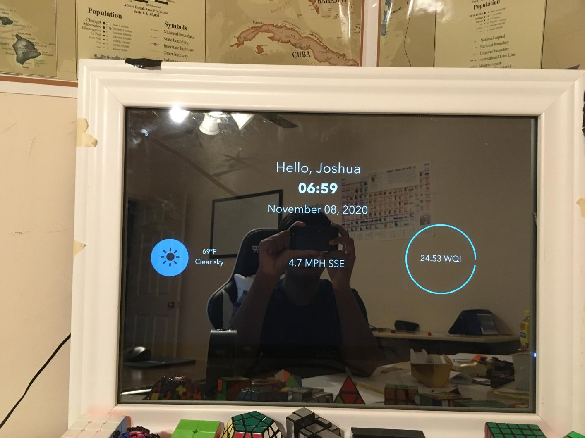
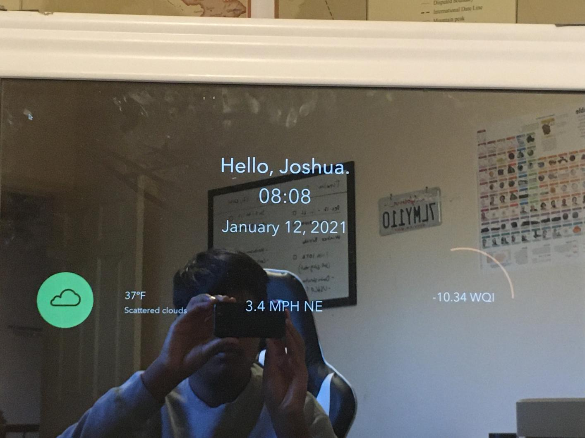

# Smyror
This repository contains code for Smyror, a UI design for a smart mirror.

What is contained in the Smyror UI:
- Basic weather info
- Weather quality index (custom made)
- Time
- Date
- Scores for NBA games (check NBA branch)

The weather information was retrieved from the Weatherbit API, along with the information to calculate the weather metric as depicted by the "WQI" (Weather Quality Index).

The images below were taken around 2-3 years ago, and accurately reflect the UI's design. The first two depict the UI changes in the main "page" of the UI.

.jpg)

If you take a look at the NBAStats branch, I integrated a feature where two devices were able to communicate with each other to swtich between the weather information and any specific NBA game. This was accomplished through a library called PubNub, which allows for one end to send information, and the other to receive, interpret and respond accordingly to it. PubNub code can be found in the Screen.py file of the "NBAStats" branch. Please note that the setup of the Mirror class, more particularly, the creation of the presence and status methods, were taken from PubNub's documentation on how to setup the API.

Although the code for the sending aspect of the project was lost, below is a video of the demonstration of the functionality, also filmed 2-3 years ago.

